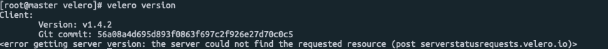

# Velero 란?

Kubernetes 클러스터 리소스 및 영구 볼륨을 백업 및 복원할 수 있는 도구.
AWS, GCP, Azure 와 연동하여 구축가능.
Ceph과 호환하여 구축

### 1) 정보

- 버전 정보: v1.5
- 릴리즈: https://github.com/vmware-tanzu/velero/releases/tag/v1.5.1
- Git: [https://github.com/vmware-tanzu/velero](https://github.com/vmware-tanzu/velero)
- Download: https://github.com/vmware-tanzu/velero/releases/download/v1.5.1/velero-v1.5.1-linux-amd64.tar.gz
- Document: https://velero.io/docs/v1.5/

### 2) 수행

- 클러스터 백업 및 복원
- 클러스터 리소스를 다른 클러스터로 마이그레이션
- 클러스터 복제( ex) 프로덕션 클러스터를 개발용 클러스터에 복제 )

### 3) 구성

- 클러스터에서 실행되는 서버
- 로컬에서 실행되는 커맨드라인 형태의 Client

### 4) 작동원리

on-demand(요청이 있을 시 언제든) 백업, 예약 백업, 복언 등 각 작업은 사용자 지정 리소스(CRD)로 정의됨.

### 5) 목적

연구자 및 박사들의 연구 결과 및 환경설정, 데이터 등을 스냅샷 백업함. 백업된 스냅샷을 추후 Deploy로 복원하여 연구를 지속할수 있도록 함.

# 설치

### 1) 전제 조건

- Kubernetes v1.10 이상 설치
- kubectl 설치
- 클러스터 노드는 CPU4개 이상

### 2) 다운로드 및 명령어 설정

```bash
wget https://github.com/vmware-tanzu/velero/releases/download/v1.5.1/velero-v1.5.1-linux-amd64.tar.gz
tar zxf velero-v1.5.1-linux-amd64.tar.gz
cd velero-v1.5.1-linux-amd64
chown -R root:root ./*
cp velero /usr/local/bin

## 자동완성 
echo "source <(velero completion bash)" >> ~/.bashrc #서버 재접속
```

### 3) Velero 서버 설정

velero 사용을 위해서는 helm2 의 tiller와 비슷한 형태로, velero 서버 구축이 필요함.

```bash
velero version
```



1. Velero 관련 자격 증명 파일 생성

    ```bash
    cd velero-v1.5.1-linux-amd64/examples/minio
    vi credentials-velero
    --------------------
    [default]
    aws_access_key_id = minio
    aws_secret_access_key = minio123
    --------------------
    ```

2. Minio 및 Velero 설치

    ```bash
    ## Minio 설치 ##
    vi 00-minio-deployment.yaml
    --------------------
    ... 중략 ...
    apiVersion: v1
    kind: Service
    metadata:
      namespace: velero
      name: minio
      labels:
        component: minio
    spec:
      type: LoadBalancer
      ports:
        - port: 9000
          targetPort: 9000
          protocol: TCP
          nodePort: 30010
      selector:
        component: minio
    ... 중략 ...
    --------------------
    kubectl apply -f 00-minio-deployment.yaml
    ```

    ```bash
    ## Velero 설치 ##
    velero install \
        --provider aws \
        --bucket velero \
        --secret-file ./credentials-velero \
        --use-volume-snapshots=false \
        --backup-location-config region=minio,s3ForcePathStyle="true",s3Url=http://minio.velero.svc:9000 \
        --plugins velero/velero-plugin-for-aws:v1.0.0

        --backup-location-config region=minio,s3ForcePathStyle="true",s3Url=http://minio.velero.svc:9000,publicUrl=34.84.208.171:30010 \
        --plugins velero/velero-plugin-for-aws:v1.0.0,velero/velero-plugin-for-microsoft-azure:v1.0.0,velero/velero-plugin-for-gcp:v1.0.0

    velero install \
        --provider aws \
        --bucket velero \
        --secret-file ./cloud-credentials \
        --use-volume-snapshots=false \
        --backup-location-config region=minio,s3ForcePathStyle="true",s3Url=http://minio.velero.svc:9000,publicUrl=<minio가 설치된 서버:포트번호>
        # 1.2.0 버전 업되면서 install 옵션이 추가
        --plugins velero/velero-plugin-for-aws:v1.0.0,velero/velero-plugin-for-microsoft-azure:v1.0.0,velero/velero-plugin-for-gcp:v1.0.0

    ## AWS ##
    velero install 
    --provider aws 
    --plugins velero/velero-plugin-for-aws:v1.0.0 
    --bucket backups --provider aws --secret-file ./aws-iam-creds --backup-location-config region=us-east-2 --snapshot-location-config region=us-east-2 --use-restic

    ###### Ceph 오브젝트 연결 ######

    # velero 오브젝트 스토리지 AWS ACCESS KEY
    kubectl get secrets -n velero velero -o jsonpath='{.data.AWS_ACCESS_KEY_ID}' | base64 --decode

    # velero 오브젝트 스토리지 AWS_SECRET_ACCESS_KEY
    kubectl get secrets -n velero velero -o jsonpath='{.data.AWS_SECRET_ACCESS_KEY}' | base64 --decode

    vi aws-iam-creds
    ----------------------
    [default]
    aws_access_key_id = 33N1ICUFF9N4J7CKOHNS
    aws_secret_access_key = wWaOMrrMHxprj2hcl8CqBrXNkSAfxSVI6wZiwsy4
    ------------------------
    rgwPort=`kubectl get svc -n rook-ceph rook-ceph-rgw-kreonet-store-external -o jsonpath='{.spec.ports[0].nodePort}'` && \
    velero install \
        --provider aws \
        --bucket velero \
        --secret-file ./aws-iam-creds \
        --use-volume-snapshots=false \
        --backup-location-config region=ap-northeast-2,s3ForcePathStyle="true",s3Url=http://203.253.235.74:${rgwPort} \
        --plugins velero/velero-plugin-for-aws:v1.0.0
    ##############################

    rgwPort=`kubectl get svc -n rook-ceph rook-ceph-rgw-kimbig-store-external -o jsonpath='{.spec.ports[0].nodePort}'` && \
    velero install \
        --provider aws \
        --bucket velero \
        --secret-file ./aws-iam-creds \
        --use-volume-snapshots=false \
        --backup-location-config region=ap-northeast-2,s3ForcePathStyle="true",s3Url=http://34.64.71.10:${rgwPort} \
        --plugins velero/velero-plugin-for-aws:v1.1.0

    ## Velero 서버 연동 확인
    velero version

    ## Velero 서버 삭제 ##
    kubectl delete deployment velero -n velero
    kubectl delete crds -l component=velero
    kubectl delete namespace/velero clusterrolebinding/velero  # 재설치의 경우 굳이 삭제하지 않아도 된다.
    ```

3. 예제 nginx 애플리케이션 배포

    ```bash
    ## 1. nginx 샘플 Deploy 생성
    cd velero-v1.4.2-linux-amd64/examples/nginx-app
    kubectl apply -f base.yaml

    ## 2. 백업
    velero backup create nginx-backup --selector app=nginx

    ## 3. 복원
    velero restore create --from-backup nginx-backup
    ```

# 간단 사용법

```bash
#### 백업 ####
# 네임스페이스 지정
$ velero backup create <BACKUP_NAME> --include-namespaces tpas,heimdall,kafka
 
# 특정 네임스페이스 제외
$ velero backup create <BACKUP_NAME> --exclude-namespaces default,kube-system
 
# 네임스페이스의 특정 리소스 제외
$ velero backup create <BACKUP_NAME> --include-namespaces tpas,heimdall,kafka --exclude-resources ingress,service
 
# 백업 데이터 확인 / 어떤 리소스가 백업되어 있는지 확인 가능
$ velero backup describe <BACKUP_NAME> --details

#### 스케쥴링 백업 ####
velero schedule create <schedule-name> --schedule="0 1 * * * or @daily" --include-resources deployments,service

#### 백업 삭제 ####
velero backup delete <backup-name> --confirm # 바로 삭제
velero schedule delete <schedule-name>

#### 복원 ####
velero restore create <restore-name> --from-backup <backup-name>

```
