1. [개요](#개요)
2. [HTTP?](#http)
    - [HTTP/0.9](#http09)
    - [HTTP/1.0](#http10)
3. [HTTP/1.1](#http11)
   - [HTTP/1.1 동작 원리](#http11-동작-원리)
   - [HTTP/1.1 단점](#http11-단점)
   - [HTTP/1.1 단점 극복 방법](#http11-단점-극복-방법)
4. [SPDY](#spdy)
5. [HTTP/2](#http2)
    - [Multiplexed Streams](#multiplexed-streams)
    - [Header Compression](#header-compression)
    - [Binary protocol](#binary-protocol)
    - [Server Push](#server-push)
    - [Stream Prioritization](#stream-prioritization)

# 개요

HTTP 는 <span style='background-color: #fff5b1'>**Hyper Text Transfer Protocol**</span> 의 약자로 Hyper Text(<U>링크를 통해 다른 문서로 연결될 수 있는 문서</U>)를 Transfer(전송하는) Protocol(규격이 정해진 규칙 체계) 이다. 즉, 웹에서 클라이언트(브라우저)가 웹 서버(httpd, nginx, apache 등) 정보를 주고받을 수 있는 프로토콜이다.

주로 글 위주로 구성 된 예전의 웹 페이지와는 달리, 현대는 이미지 용량이 매우 커졌고 동영상의 수요와 공급도 많이 증가했다. 그러면서 기존의 통신 프로토콜도 변경해야 할 필요성을 느끼게 된다.

변경 내역을 확인해보면서 <span style='background-color: #fff5b1'>**HTTP3 까지 어떤 것들이 변경되었고, 왜 그렇게 변경되었는지**</span> 확인해보는 것이 목표이다.

# HTTP?

## HTTP/0.9

HTTP/0.9 는 One-Line Protocol 로 불린다. 이 초기 HTTP 는 버전 번호가 없는 상태로 발표되었다. HTTP 는 요청이 단일라인으로 구성되며 GET 메서드만 존재했다. 서버에 연결되면 프로토콜, 서버, 포트는 불필요해지기 때문에 아래 그림과 같이 단순한 형태를 띄었다.  
이 때는 Header 도 없었는데, HTML 만 전송될 수 있음을 의미한다. 또, 요청에 대한 상태나 오류코드도 없었다.


## HTTP/1.0

서버와 브라우저에 기능을 추가했고, 상호운용성 문제가 일반적이었다. 1996년에 이러한 문제를 해결하고자 일반적인 관례들을 적은 문서를 발행했고, 이것을 `RFC 1945` 라고 하며 HTTP/1.0 으로 정의하게 된다. HTTP/1.0 의 특징은 다음과 같다.

1. 버전 정보를 명시하기 시작
2. 응답에 status code 추가
    - 브라우저가 요청에 대한  성공과 실패를 구별
3. 요청과 응답에 헤더 개념 추가
    - 메타데이터 전송 허용
    - 유연성 및 확장성

       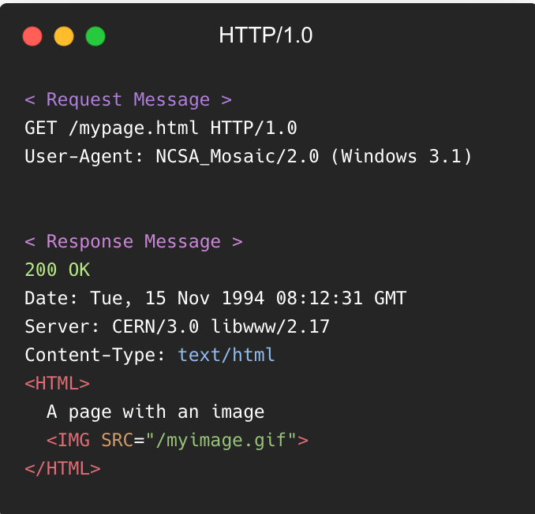

       확장된 Request, Response Message

    4. Content-Type 을 명시하면서 다른 타입의 문서도 전달 가능해짐 (ex. text/gif)

       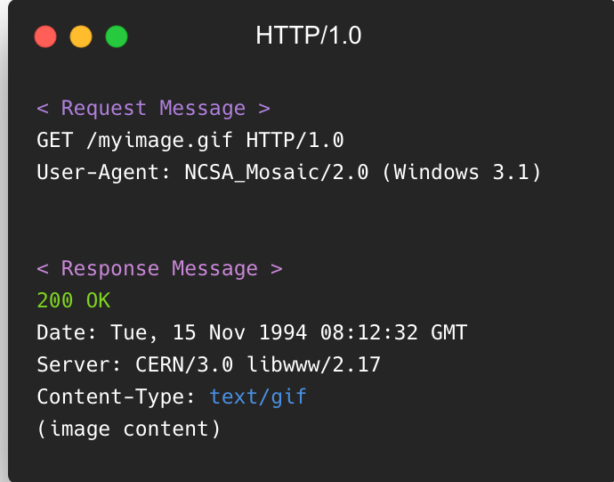

       다른 타입의 content-type


# HTTP/1.1

HTTP/1.1 는 HTTP/1.0 이 나온지 몇 달 안된 1997년 초에 공개되었습니다. 
HTTP/1.0 의 모호함을 없애고 명확한 정의를 내리게 됩니다.  

1. 커넥션의 재사용 가능
    - Keep-Alive header 를 통해 기존 연결과의 handshake 생략 가능
2. pipelining 추가
    - 이전 요청의 응답을 완전히 전송되기 전에 다음 요청을 가능하게 해서 통신 대기 시간을 낮춤
3. 청크 된 응답 지원
4. 추가적인 캐시 제어 매커니즘 도입
5. Language, Encoding, Type 등을 포함한 컨텐츠 전송
    - 가장 적합한 컨텐츠를 교환
6. Header 의 “Host” Field
    - 동일한 IP 주소에 다른 도메인을 호스트하는 것이 가능해짐


⇒ 많은 내용들이 담겨지고, 특히 헤더가 무거워진 형태의 메세지를 확인할 수 있다.

다음은 관련 된 참고 사항이다.

- HTTPS  
  TCP/IP 스택을 통해 HTTP 를 전송하는 대신, 암호화 된 전송 계층인 SSL 을 이용하여 전송한다. 웹에서 주소록이나 이메일, 사용자의 위치 정보나 개인정보 등에 접근하게 되면서 보안의 중요성이 대두되게 되고, SSL 은 TLS 로 발전한다. 현재는 SSL 이 아닌 TLS 를 사용하지만 보편적으로 SSL 이라 부르기 때문에 SSL/TLS 를 혼용하여 부른다.
- RESTful API  
  2000 년에 HTTP 사용에 대한 새로운 사용 패턴으로 REST 가 등장한다. 표준 규격이 없다는 단점은 있지만, 2010 년 부터는 매우 일반적으로 사용되고 있다.

## HTTP/1.1 동작 원리

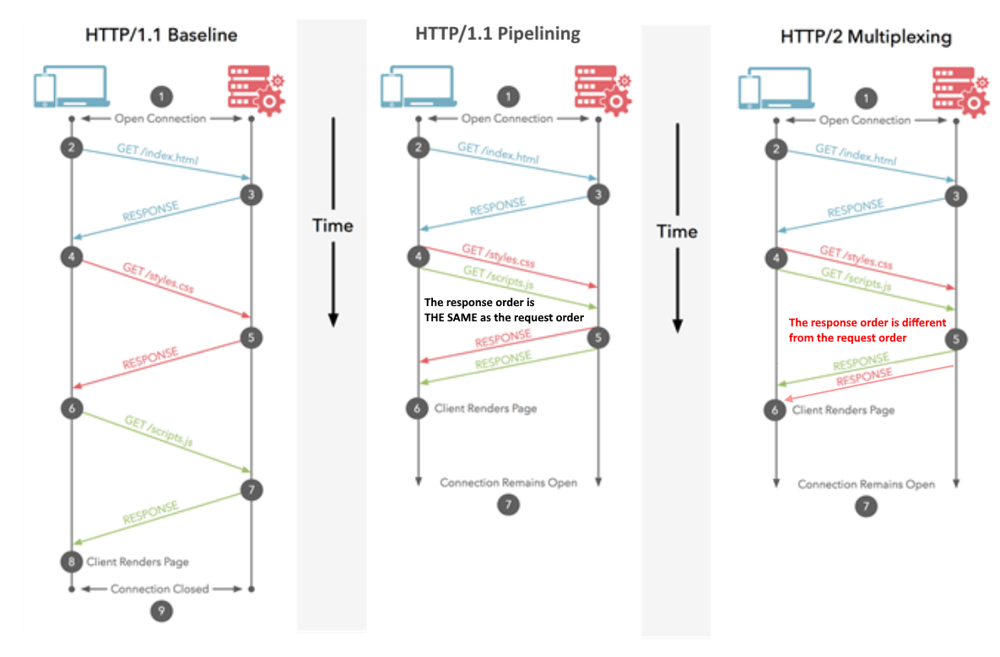

왼쪽은 HTTP/1.1 Baseline 통신 규약이고, 오른쪽은 Pipelining 기능이 도입 된 HTTP/1.1 통신 과정이다.

HTTP/1.1 의 동작은 기본적으로 Connection 당 하나의 요청을 처리하도록 설계되어 있다. 동시 전송이 불가능하고 요청과 응답이 순차적으로 이뤄진다. 또, HTML 문서 안에 포함 된 다수의 리소스(image, CSS, script) 를 처리하려면 요청할 리소스 갯수에 비례해서 Latency(대기 시간)는 길어지게 된다.

## HTTP/1.1 단점

### HOL(Header Of Line Blocking) Blocking

HTTP/1.1 의 pipelining 은 한 커넥션에 순차적인 여러 요청을 연속으로 하고, 그 순서에 맞춰 응답을 받는 방식으로 지연 시간을 줄였다.
하지만.. 순차적으로 응답을 받다보니 이전에 받은 응답이 길어지면 그 이후의 응답은 지연된다.

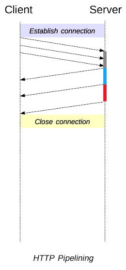

예를 들어 3개의 이미지를 받기 위해 아래와 같이 순서대로 요청을 보냈다고 했을때, 이 순서에 맞게 응답을 받아야 한다.

```bash
| --- a.png --- |
                | --- b.png --- |
                                | --- c.png --- |
```

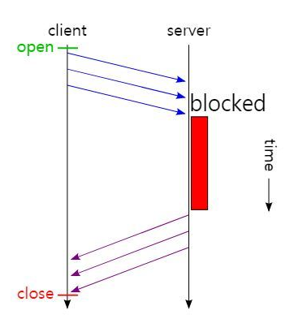

그런데 a.png 의 응답이 길어지면 뒤에 있는 응답도 그에 따라 지연되게 되는 문제가 생긴다. 이는 pipelining 의 큰 문제점 중 하나다.

```bash
| -------------------- a.png ------------------ |
                                                | -b.png- |
                                                          | --c.png-- |
```

### RTT(Round Trip Time) 증가

HTTP/1.1 의 동작은 기본적으로 Connection 당 하나의 요청을 처리한다. 그래서 매번 요청별로 Connection 을 만들고 TCP 상에서 동작하는 HTTP 특성 상 3-way Handshake 가 반복적으로 일어나게 된다. 이는 불필요한 RTT 증가와 네트워크 지연을 초래하여 성능을 지연시킬 수 있다.

참고로, RTT 란 요청(SYN)을 보낼 때부터 응답(SYN+ACK)을 받을 때까지의 왕복 시간을 의미한다.

### 무거운 Header 구조

HTTP/1.1 은 발전을 해오면서 헤더에 많은 메타 정보들을 저장하게 되었다. 사용자가 방문한 웹페이지는 다수의 http 요청이 발생하게 되는데, 이 경우 매 요청시 마다 중복된 헤더값을 전송하게 된다. 또한 해당 도메인에 설정된 cookie 정보도 매 요청시마다 헤더에 포함되어 전송되어 성능을 저하시킨다.

## HTTP/1.1 단점 극복 방법

### Image Spriting

웹페이지를 구성하는 이미지 파일 요청 횟수를 줄이기 위해, 하나의 큰 이미지로 만든다음 CSS 로 좌표 값지정해서 해당부분만 보여주는 방식

### Domain Sharding

다수의 Connection 을 생성하여 병렬로 요청을 보낸다. 하지만 브라우저 별로 도메인당 Connection 개수 제한이 존재하기 때문에 근본적인 해결책이 아니다.

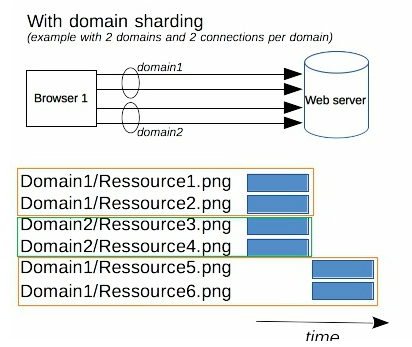

### Minify CSS/javascript

http 를 통해 전송되는 데이터 용량을 줄이기위해 CSS, javascript 코드를 축소 압축시킨다.

## Data URI Scheme

Data URI Scheme 는 HTML 문서 내 이미지 리소스를 Base64 로 인코딩 된 이미지 데이터로 직접 기술하는 방식이다.
이를 통해 요청 수를 줄인다.

### Load Faster

- 스타일시트를 HTML 문서 상위에 배치
- 스크립트를 HTML 문서 하위에 배치

# SPDY

웹 환경이 계속해서 바뀌면서 (리소스 증가, 다수의 도메인, 동적 웹 서비스, 보안의 중요성 등) 구글은 전송 지연 latency 문제의 해결에 집중하며 HTTP를 고속화한 새로운 프로토콜인 SPDY 를 구현한다. SPDY 는 `speedy`라는 단어를 기반으로 구글이 만든 조어이다.

SPDY 는 실제로 HTTP/1.1 에 비해 상당한 성능 향상과 효율을 보여줬고 이는 HTTP/2 초안의 참고 규격이 되었다.

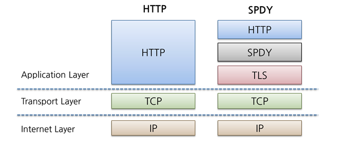

SPDY 의 특징은 다음과 같은데, HTTP/2 와 겹치는 부분이 많다. (자세한건 HTTP/2 에서…)

1. 항상 TLS 위에서 동작
    - HTTPS 로 작성된 웹 사이트만 적용 가능
2. HTTP 헤더 압축
    - 요청이 많아질수록 압축률은 커짐. 대역폭이 작은 모바일 환경에서 효과가 큼
3. 텍스트가 아닌 바이너리 프로토콜
    - 파싱이 더 빠르고, 오류 발생 가능성이 낮음
4. Multiplexing
    - 하나의 커넥션 안에서 다수의 독립적인 스트리밍을 동시 처리
5. Full-duplex interleaving & Prioritization
    - 다른 스트림이 끼어드는(interleaving) 것을 허용
6. Server Push

⇒ HTTP 의 데이터 전송 포맷과 커넥션 관리 부분을 수정하여 TCP 커넥션을 효율적으로 쓰도록 하였다.

# HTTP/2

>
💡 The focus of the protocol is on performance; specifically, end-user perceived latency, network and server resource usage. One major goal is to allow the use of a single connection from browsers to a Web site.  
> <div style="text-align: right;padding-right: 10%">- <a href="https://http2.github.io/" target="_blank">https://http2.github.io/</a></div>

[HTTP2 의 Github 블로그](https://http2.github.io/)를 보면, HTTP/2 는 HTTP/1 의 확장으로 <span style='background-color: #fff5b1'>**기존 HTTP/1 과 호환성을 유지하고 성능에 초점을 맞춘 프로토콜**</span>이라고 쓰여있다.
다음은 어떤 특징들을 갖고있는지 확인해본다.

### Multiplexed Streams

<span style='background-color: #fff5b1'>**하나의 연결로 동시에 여러개의 메시지**</span>를 주고 받을수 있고, <span style='background-color: #fff5b1'>**순서에 상관없이 스트림**</span>으로 주고 받는다.

- 스트림(Stream)
  - 시간이 지남에 따라 사용할 수 있게 되는 일련의 데이터 요소를 가리키는 **데이터 흐름**
  - 메시지를 독립된 프레임으로 조각내어 송수신한 이후 다시 조립하여 **데이터를 주고 받는 원리**

특정 스트림의 패킷이 손실되었다고하더라도 해당 스트림에만 영향을 미친다.

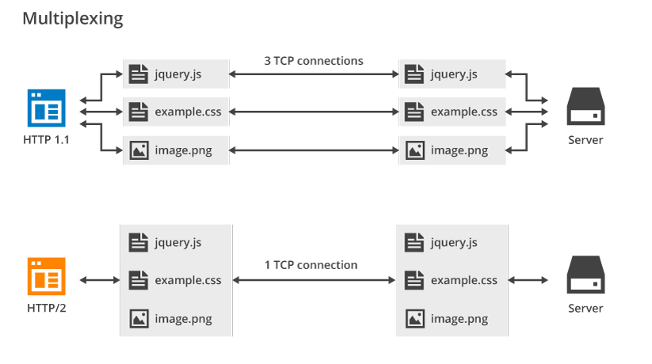
하나의 연결로 여러개의 메시지를 주고받음.


순서에 상관없음.

⇒ 단일 연결로 병렬 요청을 받을 수 있고, HTTP/1.1 에서 발생하는 문제인 <span style='background-color: #fff5b1'>**HOL Blocking 문제를 해결**</span>할 수 있다.
(HTTP/1.1 의 Connection Keep-Alive, Pipelining 개선)

⇒ RTT 시간이 줄어들어 별도의 최적화 과정 또는 도메인 샤딩없이 웹 사이트 로드 속도가 빨라진다.

### Header Compression

HTTP/2 는 중복 헤더 프레임을 압축해서 전송한다.

헤더 정보를 압축하기 위해 Headere Table 과 Huffman Encoding 기법을 사용하여 처리한다. 이를 HPACK 압축방식 이라고 부르며 별도의 명세서 (RFC 7531)로 관리한다.

클라이언트와 서버에서 모두 이전 요청에 사용 된 헤더 목록을 유지 관리한다.(Header Table) HPACK 은 서버로 전송되기 전에 각 헤더의 개별 값을 압축한 다음 이전에 전송된 헤더 값 목록에서 인코딩 된 정보를 조회하여 전체 헤더 정보를 재구성한다.(Huffman Encoding)

- 허프만 인코딩
  - 문자열을 문자 단위로 쪼개어 빈도수를 센다. 빈도가 높은 정보는 적은 비트 수를 사용하여 표현하고, 빈도가 낮은 정보는 비트 수를 많이 사용하여 표현한다. 이를 통해 전체 데이터 표현에 필요한 비트양을 줄인다.

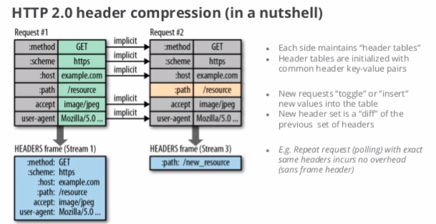

> 원리를 좀만 더 자세히 설명하자면… 위 그림처럼 클라이언트가 두번의 요청을 보낸다고 가정하면 HTTP/1 의 경우 두개의 요청 Header 에 중복 값이 존재해도 그냥 중복 전송한다. 하지만 HTTP/2 에서는 Header 에 중복 값이 존재하는 경우 Static/Dynamic Header Table 개념을 사용하여 중복 Header 를 검출하고, 중복 된 Header 는 index 값만 전송한다. 중복되지 않은 Header 정보 값은 허프만 인코딩 처리하여 전송한다.
>

⇒ 모바일과 같이 업로드 대역폭이 상대적으로 작은 경우에는 특히 HTTP 헤더 압축 방식이 유용하다. 오늘날의 HTTP 헤더는 평균 2KB 가량이고, 점점 더 커지는 추세이기 때문에 HTTP 헤더 압축의 가치는 앞으로 더 커질 것이라고 한다.

### Binary protocol

텍스트 프로토콜에서 바이너리 프로토콜로 변화됬다. 기존 HTTP/1 에서 사용된 frame 의 복잡성을 편리하게 해주고, 텍스트와 공백들이 섞여 혼동이 발생하던 명령들보다 명령어를 단순하게 구현할 수 있다.

바이너리 프로토콜을 사용하면 다음과 같은 이점들이 있다.

1. 데이터 파싱이 더 빠르고, 오류 발생 가능성이 낮음.
2. 네트워크 리소스의 효과적 사용
    - 네트워크 지연 시간을 줄이고 처리량을 개선
3. 텍스트 특성과 관련된 보안 문제를 해결할 수 있음
    - (EX. Response Splitting Attacks - 요청 파라미터에 개행문자(CR/LF) 포함 시 응답이 분리될 수 있음. 공격자는 악성코드 포함하여 XSS 및 캐시를 훼손.)
4. HTTP/2 의 다른 기능 활성화
    - 압축, 멀티플렉싱, 우선 순위 지정, 흐름 제어 및 TLS 의 효과적인 처리

### Server Push

서버는 요청되지 않았지만 향후 요청에서 예상되는 추가 정보를 클라이언트에게 전송할 수 있다.

예를 들어, 클라이언트(브라우저)가 HTML 문서를 요청하고 해당 HTML 에 여러 개의 리소스(CSS, image 등)가 포함되어 있다고 가정한다. HTTP/1.1 에서 클라이언트는 요청한 HTML 문서를 수신한 후 HTML 문서를 해석하면서 필요한 리소스를 재요청하는 반면, HTTP/2 에서는 Server Push 기법을 통해 클라이언트가 요청하지 않은 (HTML 문서에 포함 된 리소스들) 리소스를 Push 해주는 방법으로 <span style='background-color: #fff5b1'>**클라이언트 요청을 최소화하여 성능 향상**</span>을 이끌어낸다.

이를 PUSH_PROMISE 라고 부르고, PUSH_PROMISE 를 통해서 서버가 전송한 리소스는 클라이언트가 요청하지 않는다.

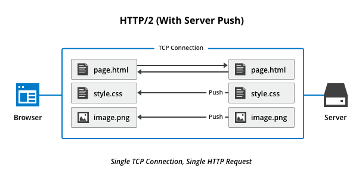

Server Push 는 다음과 같은 부분에서 유용하다.

1. 클라이언트는 푸시 된 리소스를 캐시에 저장
    - 캐시 된 리소스를 여러 페이지에 걸쳐 재사용 할 수 있음.
2. 서버는 멀티플레싱으로 [요청한 정보 + 푸시 할 리소스] 전송 가능
3. 서버는 푸시되는 리소스의 우선 순위를 지정할 수 있음.
4. 클라이언트의 선택적 리소스 관리
    - 푸시 된 리소스를 거부하거나 서버 푸시를 비활성화할 수 있음.
5. 클라이언트가 멀티플렉싱되는 푸시 스트림 수 제한 가능

### Stream Prioritization

클라이언트가 선호하는 응답 수신 방식을 지정해서 응답받을 수 있다.

문서 내 CSS 파일 1개와 이미지파일 2개 가 존재하고, 이를 클라이언트가 요청한다고 가정하겠다. 이미지 파일보다 CSS 파일의 수신이 늦어진다면 브라우저 렌더링 문제가 생길 수있는데, HTTP/2 는 이런 상황을 고려해서 <span style='background-color: #fff5b1'>**리소스간 의존관계에 따른 우선순위를 설정**</span>하고 리소스 로드 문제를 해결할 수 있다.

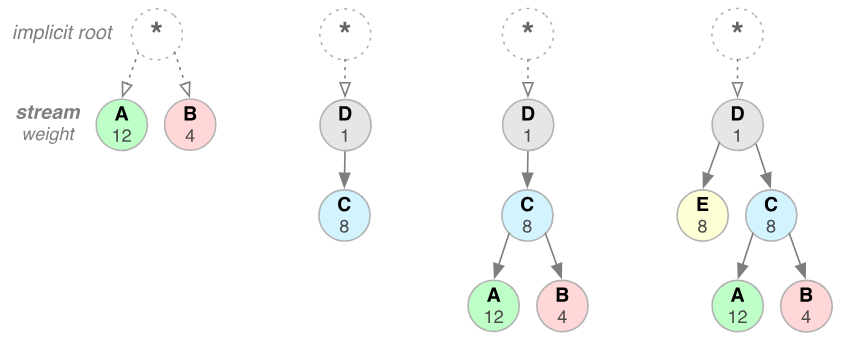 

<참고 자료>
- [https://gngsn.tistory.com/99#recentComments](https://gngsn.tistory.com/99#recentComments)
- [https://east-star.tistory.com/18](https://east-star.tistory.com/18)
- [https://ijbgo.tistory.com/26](https://ijbgo.tistory.com/26)
